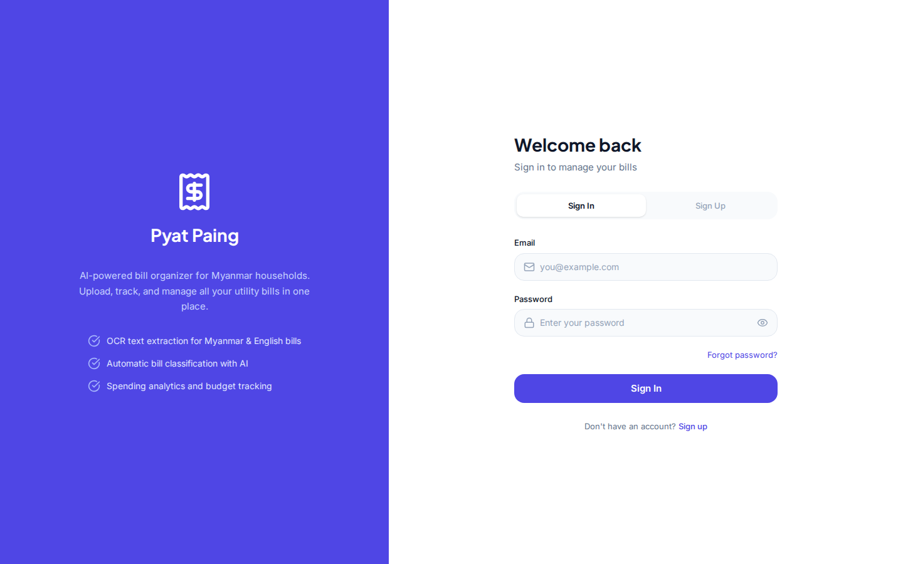
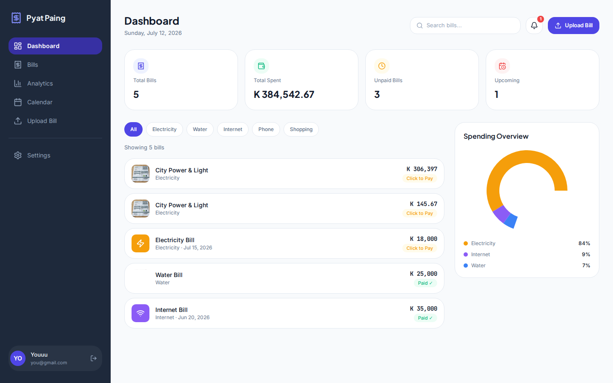
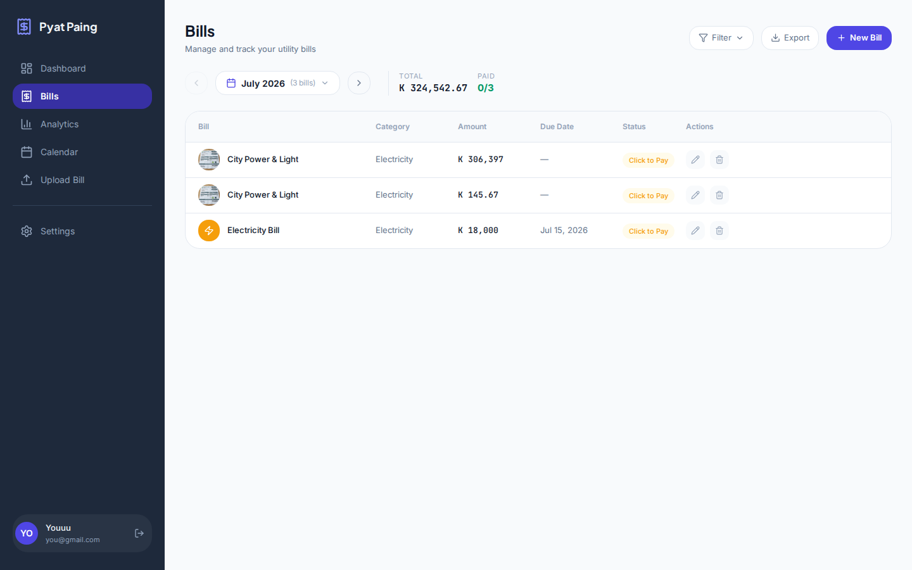
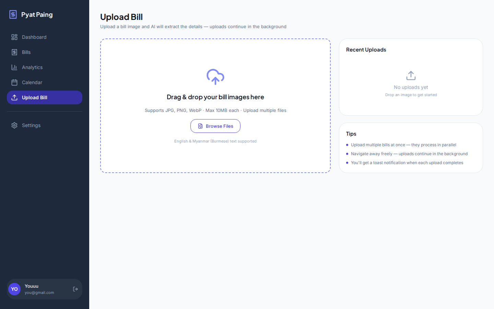
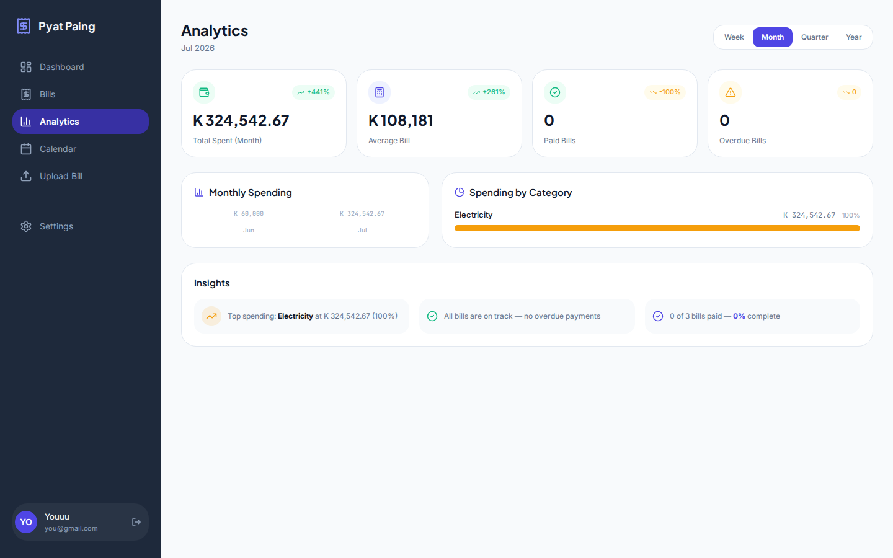
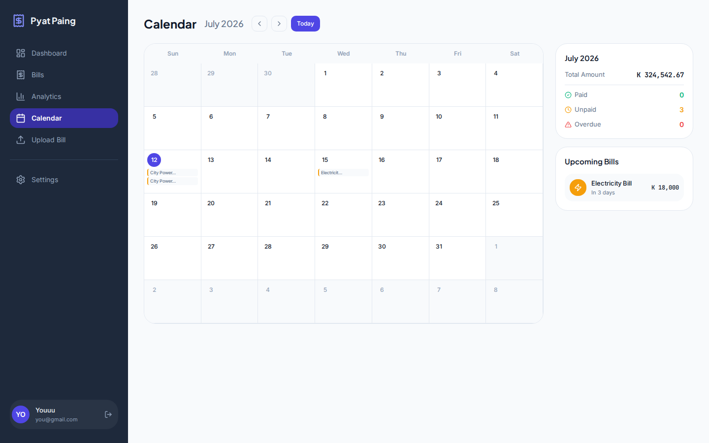
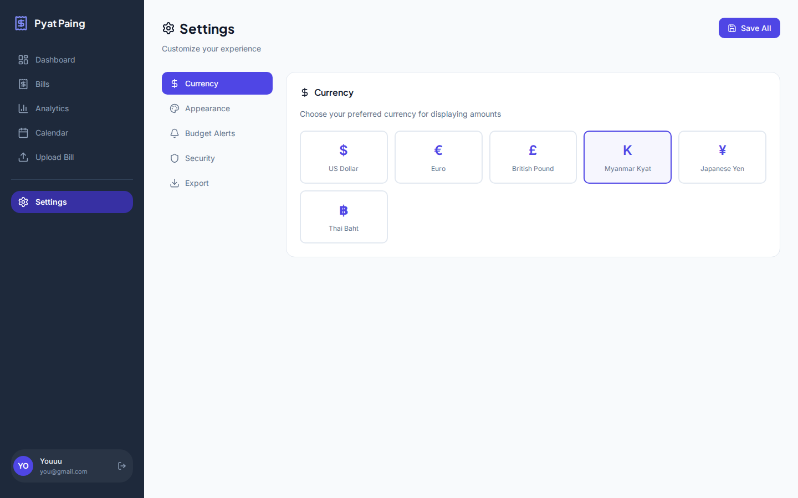
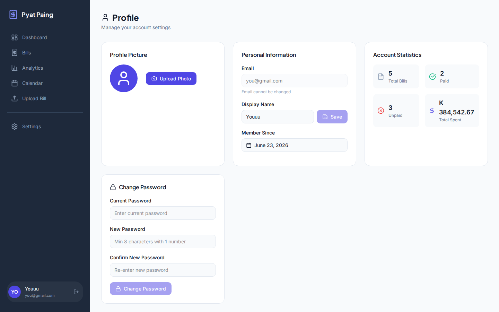

<!-- _class: lead -->
<!-- _paginate: false -->

<span class="tag">MERN Stack Project</span>

# Pyat Paing

### AI-Powered Bill Organizer for Myanmar

<span class="muted">Upload bills → OCR → AI Classification → Dashboard → Analytics</span>

---

## The Problem

Managing household bills in Myanmar is painful:

- 📄 **Paper bills pile up** — electricity, water, internet, phone bills stack up
- ⌨️ **Manual data entry** — typing amounts into spreadsheets is slow and error-prone
- 🇲🇲 **Myanmar language barrier** — most apps only support English
- 💸 **No spending visibility** — hard to know where your money goes
- ⏰ **Missed payments** — forgotten due dates = late fees

---

## The Solution

**Pyat Paing** automates the entire bill management workflow:

1. 📸 **Snap & Upload** — take a photo of any bill
2. 👁️ **OCR Extraction** — reads Myanmar + English text (offline, free)
3. 🤖 **AI Classification** — auto-detects title, amount, category, currency
4. 💱 **Currency Conversion** — converts to MMK with live exchange rates
5. 📊 **Dashboard** — filterable grid with spending analytics
6. ⏰ **Bill Management** — due dates, recurring, payment tracking

---

## How It Works

```
📸 Upload bill image
  → ☁️ Cloudinary (image storage)
  → 👁️ Tesseract.js OCR (Myanmar + English, offline)
  → 🤖 Cohere Command A (structured JSON + currency detection)
  → 💱 Currency Conversion (live rates from open.er-api.com)
  → 🗄️ MongoDB (bill storage in MMK)
  → 📊 React Dashboard (filter, search, edit, analytics)
```

---

<!-- _class: lead -->

## Tech Stack

| Layer | Technology |
|-------|-----------|
| **Frontend** | React 19 + TypeScript + Vite |
| **Backend** | Node.js + Express 5 |
| **Database** | MongoDB Atlas + Mongoose 9 |
| **OCR** | Tesseract.js (offline, no API keys) |
| **AI** | Cohere Command A |
| **Storage** | Cloudinary |
| **Charts** | Recharts |
| **Styling** | Tailwind CSS v4 |
| **Auth** | JWT + httpOnly cookies |

---

## Live Demo — Login & Auth



- JWT httpOnly cookies (XSS-safe)
- Account lockout after 5 failed attempts
- Rate limiting on auth endpoints

---

## Live Demo — Dashboard



- Total bills, spending, unpaid count at a glance
- Budget alerts (warning at 80%, danger at 100%)
- Upcoming bills with overdue indicators

---

## Live Demo — Bills Page



- Month-by-month navigation
- Category filter tabs
- Edit bills with image replacement
- Toggle paid/unpaid status

---

## Live Demo — Upload



- Drag & drop or browse files
- Background uploads continue when navigating away
- Progress indicator with dismiss buttons

---

## Live Demo — Analytics



- Period filters: Week / Month / Quarter / Year
- Monthly spending bar chart
- Category breakdown with percentages
- Dynamic insights

---

## Live Demo — Calendar



- Bills shown as chips on due dates
- Click any day to see details + toggle payment
- Month stats sidebar

---

## Live Demo — Settings



- 6 currencies: MMK, USD, EUR, GBP, JPY, THB
- Light / Dark / System theme (applies instantly)
- Budget alerts with per-category limits
- CSV export

---

## Live Demo — Profile



- Avatar upload (Cloudinary)
- Display name
- Account statistics
- Change password

---

## Currency Conversion Pipeline

All bills stored in **MMK** as base currency:

| Step | What Happens |
|------|-------------|
| 1. Upload | User uploads a bill (e.g., $145.67 USD) |
| 2. OCR | Tesseract extracts text from image |
| 3. AI | Cohere detects currency from symbols/text |
| 4. Convert | Backend: $145.67 × 2,103 = **306,408 MMK** |
| 5. Store | MongoDB: `amount: 306408`, `originalCurrency: "USD"` |
| 6. Display | Frontend converts back to user's currency |

**Live rates** from open.er-api.com, cached for 1 hour.

---

## Security Features

| Feature | Implementation |
|---------|---------------|
| 🔒 **Auth** | JWT in httpOnly cookies + Bearer token |
| 🛡️ **Rate limiting** | Auth: 20/15min, Upload: 10/min |
| 🔐 **Account lockout** | 5 failed attempts → 15min lock |
| 🛡️ **Helmet** | CSP, HSTS, X-Frame-Options |
| 🔑 **Password** | bcryptjs hash, min 8 chars + 1 number |
| 🚫 **CORS** | Strict origin in production |
| 🧹 **Error sanitization** | Generic messages in production |

---

## Architecture

```
┌─────────────────────────────────────────────────┐
│                  Frontend (Vite)                  │
│  React 19 · TypeScript · Tailwind · Recharts     │
│  Lazy-loaded pages · Background uploads           │
└──────────────────────┬──────────────────────────┘
                       │ /api/*
┌──────────────────────▼──────────────────────────┐
│                Backend (Express 5)                │
│  JWT Auth · Multer · Rate Limiting · Pino Logger │
├──────────────────────────────────────────────────┤
│  Pipeline: Cloudinary → Tesseract → Cohere → MMK │
└────┬──────────┬──────────┬──────────┬───────────┘
     │          │          │          │
  Cloudinary  Tesseract  Cohere    MongoDB
  (images)    (OCR)      (AI)     (Atlas)
```

---

<!-- _class: dark -->

## Key Features Summary

- 📸 **Smart Upload** — drag & drop, background processing, multi-file
- 👁️ **Dual OCR** — Myanmar + English text extraction (offline)
- 🤖 **AI Classification** — auto category + currency detection
- 💱 **Live Currency** — 6 currencies with real-time rates
- 📊 **Analytics** — period filters, charts, budget alerts
- 📅 **Calendar** — interactive view with day details
- 🎨 **Themes** — Light / Dark / System (instant apply)
- 👤 **Profile** — avatar, display name, account stats
- 🔒 **Security** — JWT, rate limiting, account lockout

---

<!-- _class: dark -->
<!-- _paginate: false -->

## Get Started

**GitHub:** [github.com/youuu199/pyat-paing](https://github.com/youuu199/pyat-paing)

```bash
git clone https://github.com/youuu199/pyat-paing.git
cd pyat-paing

# Backend
cd server && npm install && npm run dev

# Frontend
cd client && npm install && npm run dev
```

### Upload. Track. Save Money. 💰
